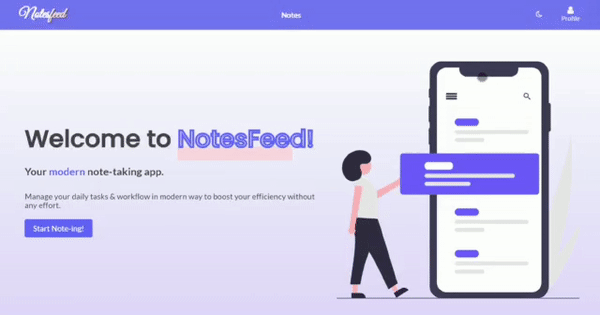

# [NotesFeed](https://notesfeed.netlify.app) - Note Taking App

[**NotesFeed**](https://notesfeed.netlify.app) is a note making app made using React JS. Now you can manage your daily tasks & workflow in modern way to boost your efficiency without any effort. This app display information with integrated light☀️/dark🌙 mode.

## Preview☀️/🌙

## Features:

- User can add new note with respective title, description, note-color & label.
- Edit note's data.
- Filter based on sort by date and label.
- Search for a particular note.
- Archive & restore note.
- Delete note in seperated folder.
- Sign in/Sign Up using mock backend (MockBee)

## Technologies & Concepts used

- React JS with useReducer + useContext
- JSX
- HTML/CSS

To know about the styled components, their variations, read the [inNotion UI Documentation](https://innotion-ui.netlify.app/).
